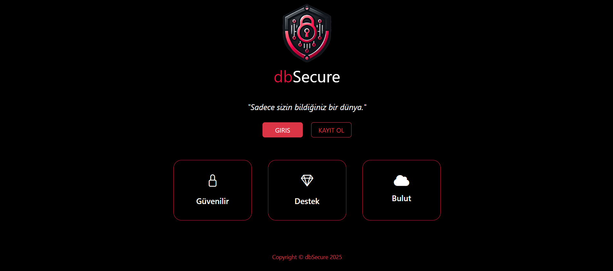
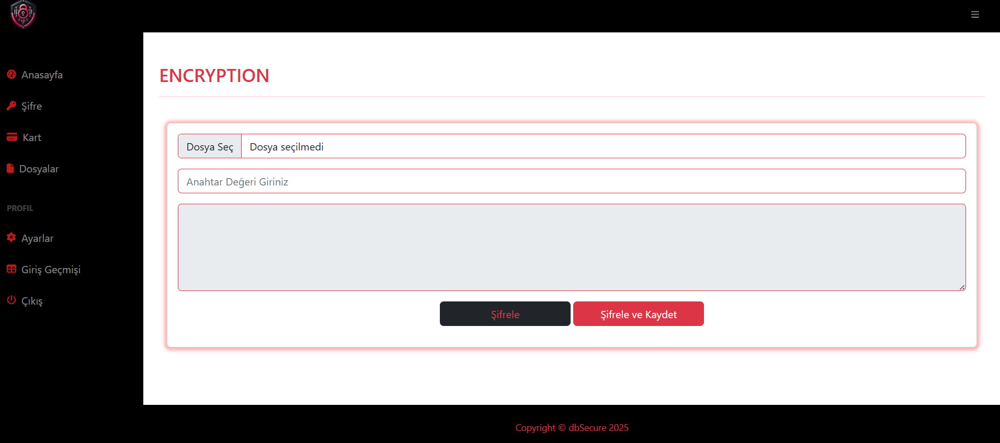
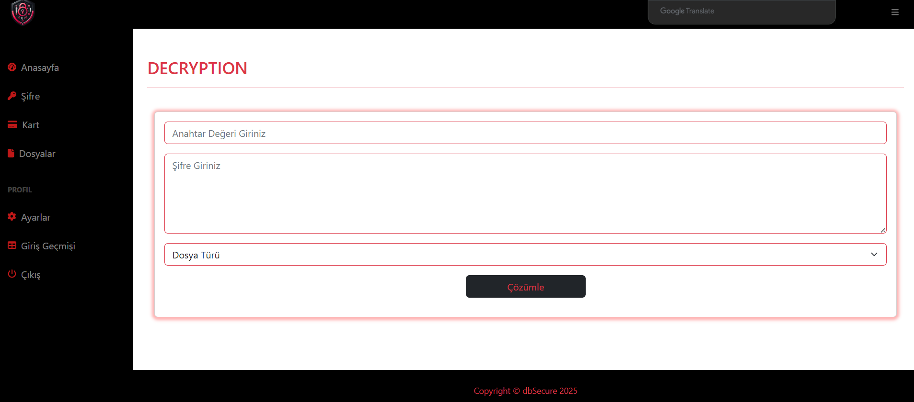
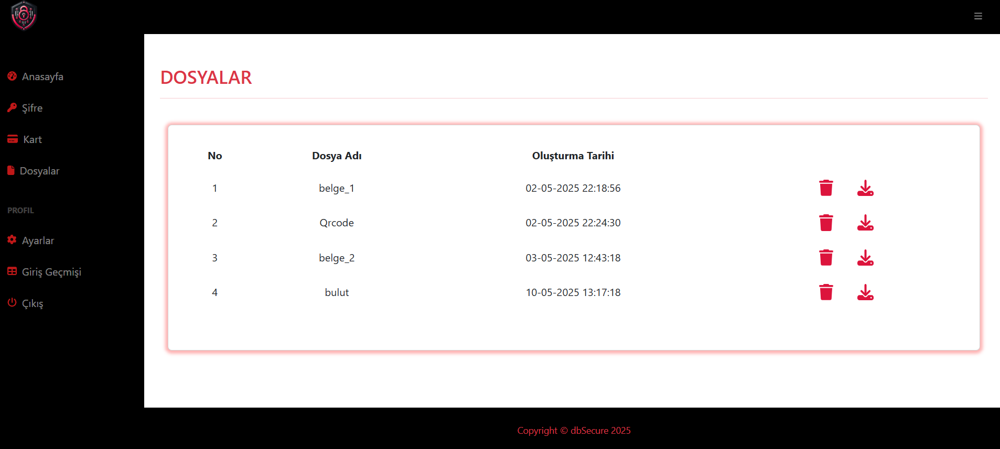

<h3>🌐 TR</h3>

# dbSecure

**Kişisel Veriler İçin Güvenli, Şifrelenmiş ve Bulutta Saklanan Web Tabanlı Sistem**

## 📌 Proje Tanıtımı

`dbSecure`, kullanıcıların kişisel verilerini AES-256-CBC algoritması ile şifreleyerek Amazon Web Services (AWS) altyapısında güvenli bir şekilde depolayan Laravel tabanlı bir web uygulamasıdır. Kullanıcı doğrulama süreci Mailgun üzerinden tek seferlik kod ile yapılmakta ve giriş log'ları ile güvenlik artırılmaktadır.

## 🚀 Özellikler

- 🔐 AES-256-CBC algoritmasıyla istemci taraflı veri şifreleme
- ☁️ Şifreli dosyaların `.enc` formatında AWS S3 üzerinde saklanması
- 🧩 AWS RDS (MySQL) üzerinde kullanıcı ve meta veri yönetimi
- 📧 Mailgun ile tek kullanımlık kod üzerinden iki aşamalı doğrulama
- 👁️ Son 10 giriş hareketinin loglanması ve kullanıcıya sunulması
- 🗃️ Şifre, kredi kartı ve dosya yönetimi modülleri

## 🛠️ Kullanılan Teknolojiler

| Katman | Teknoloji |
|-------|-----------|
| Backend | Laravel (PHP Framework) |
| Veritabanı | MySQL (AWS RDS) |
| Depolama | AWS S3 |
| E-posta Servisi | Mailgun |
| Sunucu | AWS EC2 (Linux) |
| Şifreleme | AES-256-CBC + SHA-256 |

## 🧱 Sistem Mimarisi

- Laravel tabanlı **MVC** mimarisi
- **RESTful API** yapısı
- Gelişmiş **kimlik doğrulama** ve **token yönetimi**
- Log tabanlı kullanıcı izleme
- .env ile güvenli yapılandırma yönetimi

## 📁 Modüller

1. **Şifre Yönetimi**: Kullanıcılar şifre ekleyebilir, görüntüleyebilir ve silebilir.
2. **Kart Yönetimi**: Kredi kartı bilgileri şifrelenerek güvenle saklanır.
3. **Dosya Yönetimi**: Yerel dosyalar şifrelenerek `.enc` formatında yüklenir.

## 🔐 Güvenlik Yaklaşımları

- Veriler buluta gönderilmeden **önce şifrelenir** (client-side encryption)
- Şifreleme anahtarı SHA-256 ile hashlenerek sisteme gömülür
- **Tek kullanımlık doğrulama kodu** ile brute-force saldırılarına karşı koruma
- Kullanıcıların geçmiş giriş hareketlerinin raporlanması

    
    
    
    

<h3>🌐 ENG</h3>

# dbSecure

**A Web-Based System for Secure, Encrypted, and Cloud-Stored Personal Data**

## 📌 Project Overview

`dbSecure` is a Laravel-based web application that securely stores users' personal data using AES-256-CBC encryption and Amazon Web Services (AWS) infrastructure. User authentication is enhanced through a one-time verification code sent via Mailgun, and login activities are logged to strengthen system security.

## 🚀 Features

- 🔐 Client-side data encryption with the AES-256-CBC algorithm
- ☁️ Encrypted files are stored on AWS S3 in `.enc` format
- 🧩 User and metadata management using AWS RDS (MySQL)
- 📧 Two-factor authentication via one-time code with Mailgun
- 👁️ Displays the last 10 login activities to users
- 🗃️ Modules for managing passwords, credit cards, and files

## 🛠️ Technologies Used

| Layer | Technology |
|-------|------------|
| Backend | Laravel (PHP Framework) |
| Database | MySQL (AWS RDS) |
| Storage | AWS S3 |
| Email Service | Mailgun |
| Server | AWS EC2 (Linux) |
| Encryption | AES-256-CBC + SHA-256 |

## 🧱 System Architecture

- Laravel-based **MVC** architecture
- **RESTful API** design
- Advanced **authentication** and **token management**
- Log-based user activity tracking
- Secure environment management using `.env` configuration

## 📁 Modules

1. **Password Management**: Users can add, view, or delete passwords.
2. **Card Management**: Credit card data is securely stored with encryption.
3. **File Management**: Local files are encrypted and uploaded as `.enc` format.

## 🔐 Security Approaches

- Data is encrypted **before being sent to the cloud** (client-side encryption)
- Encryption keys are hashed with SHA-256 and embedded securely
- **One-time verification codes** help prevent brute-force attacks
- Users are informed about their recent login activities
